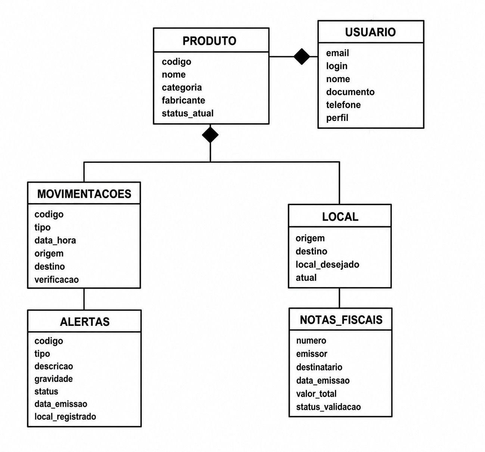

# Modelagem NoSQL: Hierarquia de Informações e Agregações
**Sistema: Rastreamento e Vigilância de Cadeia de Suprimentos**

---

## 1. Hierarquia de Informações e Agregações



---

A funcionalidade principal do sistema é rastrear a jornada de produtos ao longo de toda a
cadeia de suprimentos, identificando comportamentos suspeitos que possam indicar fraude,
desvio, perda, divergência de quantidade ou inconsistência documental.

Como o objetivo do sistema é responder rapidamente perguntas como **"onde está este
produto?"**, **"por onde ele passou?"**, **"quem está envolvido nesta entrega?"** e **"quais
alertas ainda estão em aberto?"**, a modelagem NoSQL foi organizada em torno de **1 documento
por produto**, que carrega consigo tudo que costuma ser lido junto — em vez de espalhar essas
informações em várias coleções ligadas por referência.

Neste projeto, o centro da modelagem é o **PRODUTO**: não existe mais o conceito de lote como
unidade de agregação — cada produto é rastreado e auditado individualmente, e tudo que ele
precisa (nota fiscal, histórico de movimentações, alertas, locais de origem/destino e os
usuários envolvidos) mora dentro do próprio documento.

### 1.1 Hierarquia principal

```text
Cadeia de Suprimentos
-> PRODUTO (documento central, coleção `produtos`)
   -> nota_fiscal (embutida)
   -> locais { origem, destino, local_desejado, atual } (embutidos)
   -> movimentacoes[] (embutidas, histórico completo)
      -> verificacao (resultado automático de cada movimentação)
   -> alertas[] (embutidos, ciclo de vida próprio)
   -> usuarios_associados { remetente, destinatario, recebedor } (cópia leve, por referência)
-> USUÁRIO (coleção própria `usuarios`, referenciado pelo produto)
   -> produtos_destinados[] (referência leve: quais produtos chegam a este usuário)
   -> produtos_enviados[]  (referência leve: quais produtos este usuário envia)
```

Essa hierarquia representa como as informações se conectam no sistema hoje: a cadeia de
suprimentos gira em torno do produto, que concentra em um único documento sua identidade,
documentação fiscal, rota completa e o estado de qualquer investigação em andamento. Usuários
(operadores, auditores, gestores, clientes) continuam em uma coleção própria, porque são
compartilhados por muitos produtos e têm ciclo de vida independente (podem trocar de cargo,
ser desativados etc.).

### 1.2 Agregado PRODUTO

O produto é o **documento central** do sistema — a quase totalidade das consultas parte dele.
Diferente da modelagem original (que separava lote, movimentações e alertas em coleções à
parte), o agregado de produto hoje reúne tudo isso em um só lugar:

- dados cadastrais (`codigo`, `nome`, `categoria`, `fabricante`, `status_atual`);
- a nota fiscal da operação (`nota_fiscal`);
- os locais de origem, destino e o local onde o produto está de fato agora (`locais`);
- o histórico completo de movimentações (`movimentacoes[]`), cada uma já com o resultado da
  verificação automática (`verificacao.resultado`);
- os alertas abertos ou já resolvidos sobre este produto (`alertas[]`);
- uma cópia leve dos usuários envolvidos na operação (`usuarios_associados`).

Esse agregado responde, com uma única leitura (sem `$lookup`): onde o produto está agora, por
quais locais ele passou, se alguma movimentação foi marcada como suspeita e se existe alerta em
aberto — exatamente as perguntas mais frequentes do sistema.

### 1.3 Agregado USUÁRIO

Usuários representam operadores, auditores, gestores e clientes. Como cargo, setor e status de
conta podem mudar independentemente de qualquer produto, usuários continuam em coleção própria.
O agregado de usuário reúne:

- dados cadastrais (`email`, `login`, `nome`, `documento`, `telefone`, `endereco`);
- papel no sistema (`cargo`, `perfil`, `setor`, `ativo`);
- referências leves aos produtos em que o usuário participa como destinatário
  (`produtos_destinados[]`) ou remetente (`produtos_enviados[]`) — cada item guarda só
  `codigo`, `nome` e `nota_fiscal`, o suficiente para navegar até o produto completo.

Essas listas são intencionalmente leves (não duplicam o produto inteiro) porque o documento de
usuário não precisa saber o status atual de cada produto — quem precisa disso consulta o
produto diretamente ou usa o **Pipeline 2** (seção 5), que faz esse cruzamento sob demanda.

### 1.4 Por que embutir em vez de referenciar

A modelagem anterior deste documento (lotes, movimentações, alertas, locais e notas fiscais
como coleções separadas, ligadas por referência) foi substituída por um schema **totalmente
embutido** por 3 motivos práticos:

1. **Volume por produto é pequeno e previsível.** Um produto tem poucas movimentações (a
   jornada completa, não milhares de eventos) e poucos alertas — não há risco de o documento
   crescer sem limite, que é o principal argumento contra embutir arrays.
2. **Tudo é lido junto.** Praticamente toda consulta de rastreamento quer o produto, sua rota e
   seus alertas ao mesmo tempo. Embutir elimina o `$lookup` no caminho mais quente do sistema.
3. **Escrita atômica.** Registrar uma movimentação ou abrir um alerta em um produto é uma única
   operação (`updateOne` com `$push`), sem precisar coordenar a escrita em 2 ou 3 coleções.

O custo dessa decisão é que perguntas que cruzam **muitos produtos ao mesmo tempo** (ex.: "quais
alertas estão abertos em todo o sistema, ordenados por gravidade?") deixam de ser um simples
`find` e passam a exigir uma **aggregation pipeline** com `$unwind` — é exatamente o papel das 2
pipelines descritas na seção 5.

---

## 2. Descrição e Exemplo de Documento por Coleção

O banco tem hoje apenas **2 coleções**.

### Coleção: PRODUTOS

```json
{
  "codigo": "CAF-TRK-0001",
  "nome": "Cafe Organico 500g",
  "categoria": "alimentos",
  "fabricante": "Fazenda Minas Verdes LTDA",
  "status_atual": "em_alerta",
  "nota_fiscal": {
    "numero": "NF-2026-00001",
    "emissor": "Fazenda Minas Verdes LTDA",
    "destinatario": "Ana Souza",
    "data_emissao": "2026-06-01T08:00:00Z",
    "quantidade_declarada": 80,
    "valor_total": 1500,
    "status_validacao": "em_analise"
  },
  "movimentacoes": [
    {
      "codigo": "MOV-2026-0001-1",
      "tipo": "produto_cadastrado",
      "data_hora": "2026-06-01T08:00:00Z",
      "origem": "Origem Uberlandia",
      "destino": "Destino Campinas",
      "usuario_responsavel": { "email": "joao.silva@origemcerta.com", "nome": "Joao da Silva" },
      "quantidade_informada": 80,
      "quantidade_confirmada": 80,
      "verificacao": { "resultado": "regular", "motivos": [] }
    }
  ],
  "alertas": [
    {
      "codigo": "ALT-2026-0001",
      "tipo": "produto_fora_do_local_desejado",
      "descricao": "O produto saiu ou permaneceu fora do local desejado para entrega.",
      "gravidade": "alta",
      "status": "em_analise",
      "data_emissao": "2026-06-01T17:00:00Z",
      "movimentacao": "MOV-2026-0001-4",
      "responsavel_auditoria": { "email": "maria.oliveira@origemcerta.com", "nome": "Maria Oliveira" },
      "local_desejado": "Destino Campinas",
      "local_registrado": "Ponto nao autorizado Campinas"
    }
  ],
  "locais": {
    "origem": { "nome": "Origem Uberlandia", "cidade": "Uberlandia", "estado": "MG", "coordenadas": { "latitude": -18.9186, "longitude": -48.2772 } },
    "destino": { "nome": "Destino Campinas", "cidade": "Campinas", "estado": "SP" },
    "local_desejado": "Destino Campinas",
    "atual": { "nome": "Ponto nao autorizado Campinas", "cidade": "Campinas", "estado": "SP" }
  },
  "usuarios_associados": {
    "remetente": { "email": "joao.silva@origemcerta.com", "nome": "Joao da Silva" },
    "destinatario": { "email": "ana.souza@origemcerta.com", "nome": "Ana Souza" },
    "recebedor": { "email": "carlos.lima@origemcerta.com", "nome": "Carlos Lima" }
  }
}
```

### Coleção: USUARIOS

```json
{
  "email": "joao.silva@origemcerta.com",
  "login": "joao.silva",
  "nome": "Joao da Silva",
  "documento": "123.456.789-10",
  "telefone": "(34) 99999-0001",
  "endereco": { "logradouro": "Rua das Acacias", "cidade": "Uberlandia", "estado": "MG" },
  "cargo": "Operador de armazem",
  "perfil": "operador",
  "ativo": true,
  "setor": "operacao",
  "produtos_destinados": [
    { "codigo": "SAL-TRK-0003", "nome": "Sal Marinho 500g", "nota_fiscal": "NF-2026-00003" }
  ],
  "produtos_enviados": [
    { "codigo": "CAF-TRK-0001", "nome": "Cafe Organico 500g", "nota_fiscal": "NF-2026-00001" }
  ]
}
```

---

## 3. Exemplo de Agregado para Consulta Rápida

Como o produto já é, por si só, o "agregado para consulta rápida" (não existe mais um passo
extra de juntar lote + produto), o exemplo relevante aqui passa a ser o **resultado das
aggregation pipelines** — visões que cruzam **vários** produtos/usuários de uma vez, algo que
nenhum dos 2 documentos acima consegue responder sozinho.

Exemplo real de saída do **Pipeline 1** (relatório de alertas ativos, seção 5.1), rodado contra
o Atlas:

```json
{
  "produto_codigo": "MEL-TRK-0029",
  "produto_nome": "Mel Silvestre 300g",
  "alerta_codigo": "ALT-2026-0029",
  "gravidade": "media",
  "gravidade_peso": 2,
  "dias_em_aberto": 36,
  "status": "em_analise",
  "local_desejado": "Destino Campinas",
  "local_registrado": "Ponto nao autorizado Campinas",
  "auditor": { "nome": "Beatriz Rocha", "email": "beatriz.rocha@origemcerta.com", "cargo": "Cliente destinataria", "setor": "cliente" }
}
```

Esse documento não existe em nenhuma coleção-fonte — ele é **montado** juntando `alertas[]` de
vários produtos com o cadastro atual do auditor em `usuarios`, e é persistido (via `$merge`) na
coleção `relatorio_alertas_ativos` como uma visão materializada, pronta para consulta direta.

---

## 4. Justificativa da Modelagem NoSQL

A modelagem atual usa **1 documento por produto, totalmente embutido**, e uma coleção separada
apenas para `usuarios` (que tem ciclo de vida próprio e é compartilhado por muitos produtos).

Essa escolha prioriza:

- **Leitura rápida do caminho mais comum**: consultar "onde está o produto e o que já aconteceu
  com ele" não exige `$lookup` nenhum — é um `findOne` direto na coleção `produtos`.
- **Escrita atômica**: registrar uma movimentação ou abrir um alerta é uma única operação
  (`$push`) no documento do produto, sem coordenar múltiplas coleções.
- **Documentos de tamanho previsível**: a jornada de um produto (poucas movimentações, poucos
  alertas) não cresce sem limite, diferente de, por exemplo, embutir os pedidos de um cliente
  que nunca para de comprar.

O custo dessa escolha é que perguntas **que cruzam muitos produtos ou usuários ao mesmo tempo**
não são mais um `find` simples — precisam de uma aggregation pipeline (`$unwind` para "abrir" os
arrays embutidos e `$lookup` para voltar à coleção `usuarios` quando o dado precisa estar
atualizado). É esse o papel das 2 pipelines da seção 5: cobrir exatamente o tipo de consulta que
a modelagem embutida, sozinha, não responde.

---

## 5. Aggregation Pipelines

As 2 aggregation pipelines abaixo são a materialização prática das "agregações" citadas no
título deste documento: perguntas que cruzam vários documentos das 2 coleções, algo que o
schema embutido da seção 1 não resolve sozinho. Implementação completa em
[`mongo-service.cjs`](mongo-service.cjs); evidências de execução real contra o Atlas em
[`docs/evidencias_agregacoes/`](docs/evidencias_agregacoes/README.md).

### 5.1 Pipeline 1 — Relatório de alertas ativos por gravidade e tempo em aberto

**Pergunta que responde:** "quais alertas estão abertos em todo o sistema agora, do mais grave
para o mais antigo, e quem é o auditor responsável por cada um (dados atuais, não a cópia
congelada)?"

Coleção-fonte: `produtos` · Estágios: `$match → $unwind → $match → $lookup → $unwind → $set →
$project → $sort → $merge`.

```js
db.produtos.aggregate([
  { $match: { "alertas.status": { $ne: "resolvido" } } },      // usa o índice alertas.status_gravidade
  { $unwind: "$alertas" },
  { $match: { "alertas.status": { $ne: "resolvido" } } },
  { $lookup: {
      from: "usuarios",
      localField: "alertas.responsavel_auditoria.email",
      foreignField: "email",
      as: "auditor_atual",
  }},
  { $unwind: { path: "$auditor_atual", preserveNullAndEmptyArrays: true } },
  { $set: {
      gravidade_peso: { $switch: { branches: [
        { case: { $eq: ["$alertas.gravidade", "alta"] }, then: 3 },
        { case: { $eq: ["$alertas.gravidade", "media"] }, then: 2 },
      ], default: 1 } },
      dias_em_aberto: { $dateDiff: { startDate: { $toDate: "$alertas.data_emissao" }, endDate: "$$NOW", unit: "day" } },
  }},
  { $project: {
      _id: "$alertas.codigo", produto_codigo: "$codigo", produto_nome: "$nome", categoria: 1,
      alerta_codigo: "$alertas.codigo", tipo: "$alertas.tipo", descricao: "$alertas.descricao",
      gravidade: "$alertas.gravidade", gravidade_peso: 1, status: "$alertas.status",
      dias_em_aberto: 1, local_desejado: "$alertas.local_desejado", local_registrado: "$alertas.local_registrado",
      auditor: { nome: "$auditor_atual.nome", email: "$auditor_atual.email", cargo: "$auditor_atual.cargo", setor: "$auditor_atual.setor" },
  }},
  { $sort: { gravidade_peso: -1, dias_em_aberto: -1 } },
  { $merge: { into: "relatorio_alertas_ativos", whenMatched: "replace", whenNotMatched: "insert" } },
])
```

### 5.2 Pipeline 2 — Auditoria por amostragem de exposição a produtos em risco

**Pergunta que responde:** "sorteando uma amostra de usuários ativos (técnica real de auditoria,
para não sempre auditar os mesmos), qual o percentual dos produtos destinados a cada um que
está hoje em risco (status `em_alerta` ou com alerta ainda não resolvido)?" — algo que
`usuarios.produtos_destinados[]` sozinho não guarda, porque só tem `codigo/nome/nota_fiscal`.

Coleção-fonte: `usuarios` · Estágios: `$match → $sample → $unwind → $lookup → $unwind → $set →
$group → $set → $match → $sort → $project → $merge`.

```js
db.usuarios.aggregate([
  { $match: { ativo: true } },                 // usa o índice ativo_setor
  { $sample: { size: 5 } },
  { $unwind: "$produtos_destinados" },
  { $lookup: { from: "produtos", localField: "produtos_destinados.codigo", foreignField: "codigo", as: "produto_info" } },
  { $unwind: "$produto_info" },
  { $set: {
      em_risco: { $or: [
        { $eq: ["$produto_info.status_atual", "em_alerta"] },
        { $gt: [{ $size: { $filter: {
            input: { $ifNull: ["$produto_info.alertas", []] },
            cond: { $ne: ["$$this.status", "resolvido"] },
        } } }, 0] },
      ] },
  }},
  { $group: {
      _id: { email: "$email", nome: "$nome", setor: "$setor", cargo: "$cargo" },
      total_produtos_destinados: { $sum: 1 },
      produtos_em_risco: { $sum: { $cond: ["$em_risco", 1, 0] } },
      produtos_risco_detalhe: { $push: { $cond: ["$em_risco",
        { codigo: "$produto_info.codigo", nome: "$produto_info.nome", status_atual: "$produto_info.status_atual" }, "$$REMOVE"] } },
  }},
  { $set: { percentual_risco: { $round: [{ $multiply: [{ $divide: ["$produtos_em_risco", "$total_produtos_destinados"] }, 100] }, 1] } } },
  { $match: { produtos_em_risco: { $gt: 0 } } },
  { $sort: { percentual_risco: -1 } },
  { $project: { _id: "$_id.email", email: "$_id.email", nome: "$_id.nome", setor: "$_id.setor", cargo: "$_id.cargo",
      total_produtos_destinados: 1, produtos_em_risco: 1, percentual_risco: 1, produtos_risco_detalhe: 1, data_amostragem: "$$NOW" } },
  { $merge: { into: "auditoria_amostras_risco", whenMatched: "replace", whenNotMatched: "insert" } },
])
```

Somando as duas pipelines, todos os estágios pedidos aparecem pelo menos uma vez: `sort`,
`match`, `project` (seleção de campos), `lookup`, `unwind`, `merge`, `set`, `sample` — além de
`$group`, `$dateDiff`, `$switch` e `$round`. Ambas persistem o resultado com `$merge`,
funcionando como visão materializada consultável sem reprocessar a pipeline inteira; como
`$merge` não devolve documentos ao cursor, o `mongo-service.cjs` limpa a coleção de destino
antes de cada execução e lê de volta o que a própria pipeline acabou de gravar — importante no
Pipeline 2, que usa `$sample` e por isso sortearia uma amostra diferente a cada chamada.

## 6. Índices que sustentam as pipelines

| Coleção  | Índice                                              | Sustenta                                    |
| -------- | ---------------------------------------------------- | --------------------------------------------- |
| produtos | `{ "alertas.status": 1, "alertas.gravidade": 1 }`     | `$match` de pré-filtro do Pipeline 1          |
| usuarios | `{ ativo: 1, setor: 1 }`                              | `$match { ativo: true }` inicial do Pipeline 2 |

Detalhamento completo do schema, dos 10 índices totais e das rotas HTTP das pipelines está no
`README.md` da raiz, seções **Coleções**, **Índices** e **Aggregation Pipelines**.
