# Modelagem NoSQL: Hierarquia de Informações e Documentos por Coleção
**Sistema: Rastreamento e Vigilância de Cadeia de Suprimentos**

---

## 1. Hierarquia de Informações e Agregações



---

A funcionalidade principal do sistema é rastrear a jornada de um produto ao longo de toda a cadeia de suprimentos, identificando comportamentos suspeitos que possam indicar fraude, desvio ou perda. O sujeito central de todas as operações é o **produto**: é sobre ele que o sistema faz perguntas e é a partir dele que anomalias são detectadas.


### 1.1 PRODUTO como documento raiz

O documento de produto representa a entidade principal do sistema. Ele contém os dados cadastrais do item monitorado e serve como ponto de partida para a recuperação do histórico completo da cadeia logística.

### 1.2 Agregação por referência: MOVIMENTACOES, ALERTAS, LOCAL, USUARIO e NOTAS_FISCAIS

As entidades que possuem ciclo de vida próprio ou são compartilhadas entre múltiplos registros são mantidas em coleções independentes e relacionadas por referências.

#### MOVIMENTACOES

Cada movimentação representa um evento logístico associado a um produto. Como um produto pode possuir milhares de movimentações ao longo do tempo, mantê-las em uma coleção própria evita crescimento excessivo do documento principal e facilita consultas históricas.

#### ALERTAS

Os alertas registram eventos suspeitos detectados pelo sistema. Como uma movimentação pode gerar vários alertas e os alertas possuem ciclo de vida próprio, eles são armazenados em coleção independente e referenciam a movimentação correspondente.

#### LOCAL

Armazéns, fábricas, centros de distribuição e pontos de entrega são reutilizados por inúmeras movimentações. Mantê-los em uma coleção separada evita redundância e permite consultas eficientes por localização.

#### USUARIO

Os operadores responsáveis pelas movimentações possuem atributos sujeitos a alterações, como cargo e e-mail. Mantê-los em coleção própria preserva a integridade do histórico sem necessidade de atualizações retroativas.

#### NOTAS_FISCAIS

As notas fiscais são armazenadas em coleção independente para permitir validação de unicidade e identificação de possíveis reutilizações fraudulentas do mesmo documento fiscal.


## 2. Descrição e Exemplo de Documento por Coleção

### Coleção: PRODUTO

```json
{
  "_id": "prod-cafe-organico-001",
  "nome": "Café Orgânico 500g",
  "categoria": "alimentos",
  "fabricante": "Fazenda Minas Verdes LTDA"
}
```

### Coleção: ALERTAS

```json
{
  "_id": "alerta-001",
  "produto_id": "prod-cafe-organico-001",
  "tipo": "localizacao_suspeita",
  "descricao": "Produto saiu da rota prevista em 80 km",
  "data_hora": "2024-05-10T14:31:05Z",
  "gravidade": "alta"
}
```

### Coleção: MOVIMENTACOES

```json
{
  "_id": "mov-001",
  "alerta_id": "alerta-001",
  "tipo": "saida",
  "status": "em_transito",
  "data_hora": "2024-05-10T14:30:00Z",
  "usuario_id": "usuario-001",
  "local_id": "local-001",
  "nota_fiscal_id": "nf-001"
}
```

### Coleção: USUARIO

```json
{
  "_id": "usuario-001",
  "nome": "João da Silva",
  "cargo": "Operador de Armazém",
  "email": "joao.silva@empresa.com"
}
```

### Coleção: LOCAL

```json
{
  "_id": "local-001",
  "nome": "Armazém Central Uberlândia",
  "cidade": "Uberlândia",
  "estado": "MG",
  "tipo": "armazem"
}
```

### Coleção: NOTAS_FISCAIS

```json
{
  "_id": "nf-001",
  "numero": "NF-2024-00187",
  "emissor": "Fazenda Minas Verdes LTDA",
  "data_emissao": "2024-05-09T08:00:00Z"
}
```

### Exemplo agregado seguindo a modelagem

```json
{
  "_id": "prod-cafe-organico-001",
  "nome": "Café Orgânico 500g",
  "categoria": "alimentos",
  "fabricante": "Fazenda Minas Verdes LTDA",
  "alertas": [
    {
      "_id": "alerta-001",
      "tipo": "localizacao_suspeita",
      "descricao": "Produto saiu da rota prevista em 80 km",
      "data_hora": "2024-05-10T14:31:05Z",
      "gravidade": "alta",
      "movimentacoes": [
        {
          "_id": "mov-001",
          "tipo": "saida",
          "status": "em_transito",
          "data_hora": "2024-05-10T14:30:00Z",
          "usuario": {
            "_id": "usuario-001",
            "nome": "João da Silva",
            "cargo": "Operador de Armazém",
            "email": "joao.silva@empresa.com"
          },
          "local": {
            "_id": "local-001",
            "nome": "Armazém Central Uberlândia",
            "cidade": "Uberlândia",
            "estado": "MG",
            "tipo": "armazem"
          },
          "nota_fiscal": {
            "_id": "nf-001",
            "numero": "NF-2024-00187",
            "emissor": "Fazenda Minas Verdes LTDA",
            "data_emissao": "2024-05-09T08:00:00Z"
          }
        }
      ]
    }
  ]
}
```
